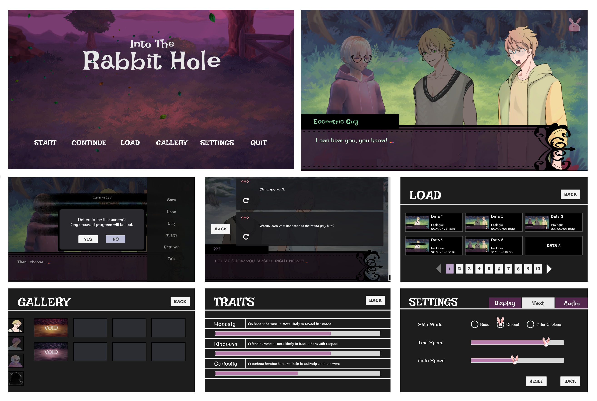

# Rabbit Hole
*A custom visual novel and narrative engine built in Unity (C#).*

Rabbit Hole features a fully custom dialogue system, designed to offer Ren’Py-like flexibility inside Unity.

## Game Features

### Dialogue & Narrative System
- Custom dialogue parser (variables, math, if/else, choices)
- Sections/labels with goto-style navigation
- Commands embedded in dialogue to trigger in-game actions
- Player text input support
- Dialogue history with the ability to rewind
- Read/unread line tracking for skip behavior
- Player stats stored and updated through dialogue variables
- Autosave triggers inside dialogue files or when exiting gameplay
- Manual save/load system
- Dialogue compiled at build time into node trees for fast runtime navigation

### Characters & Visuals
- Supports 2D, layered 2D (body + expressions), 3D, and text-only characters
- Smooth character transitions (move, fade, reposition)
- Highlight/unhighlight to show the active speaker
- Change display names, sprites, expressions, animations, or color
- Reorder characters (control who appears in front)
- Dialogue commands to change backgrounds

### UI & Presentation
- Smooth typewriter text with adjustable speed
- Auto-advance mode with customizable timing
- Unlockable CG gallery (supports variations)
- Main menu particle effects
- Options menu for:
  - Master / music / SFX / ambient / voice volume
  - Text speed & auto speed
  - Skip mode (read, unread, or after choices)
  - Fullscreen, resolution & quality settings
- All settings saved and restored across sessions

## Developer Notes (Unity)
When adding new CGs or editing dialogue files, run:

**Tools → Build CG Bank**  
**Tools → Compile Dialogue Files**

These must be run at least once when setting up the project.